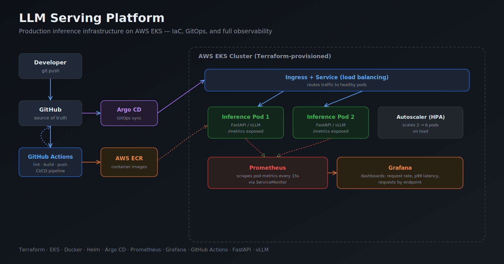
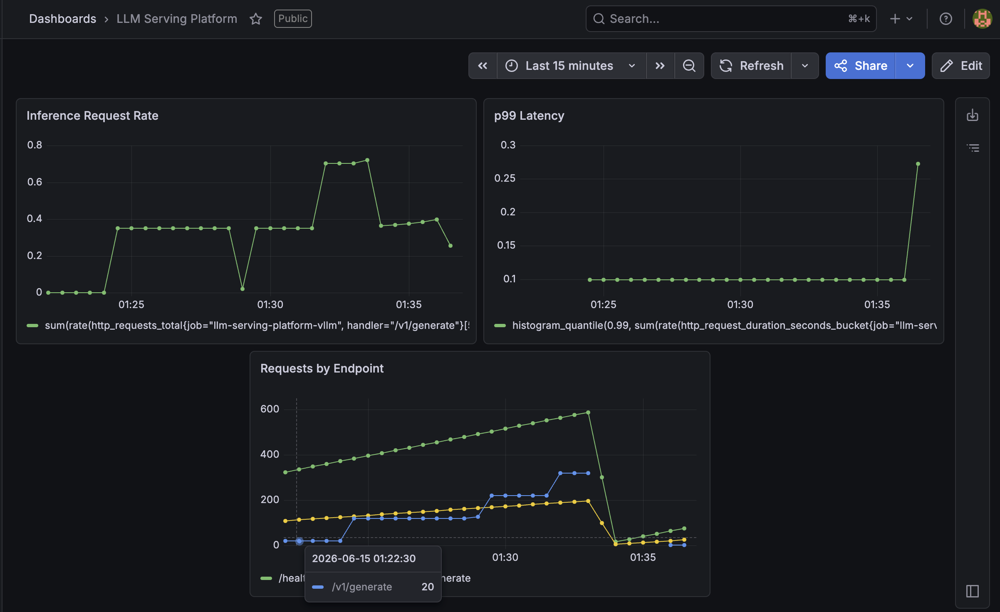
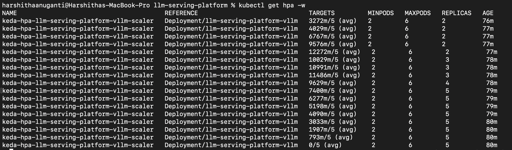

# LLM Serving Platform

A production-grade large language model serving platform built on Kubernetes, designed to handle real-world inference workloads with autoscaling, GitOps deployments, and full observability.



> 📝 **Read the story behind this project:** [I Built an LLM Platform Without Burning Cash on GPUs](https://medium.com/@anugantiharshitha/i-built-an-llm-platform-without-burning-cash-on-gpus-2de914396715)

## Overview

This platform accepts text prompts via a REST API and returns generated text using a hosted language model, built to mirror how AI companies serve LLMs in production. The system is designed for reliability, cost efficiency, and operational visibility — not just getting a model running, but keeping it running well under load.

The platform is built in two phases. Phase 1 uses a CPU-based FastAPI stub to validate the full infrastructure stack end to end — Kubernetes, Helm, CI/CD, GitOps, observability, and autoscaling — without GPU costs. Phase 2 swaps in a real vLLM inference engine (Llama-3 8B) by changing a few lines in the Helm values file. The platform architecture is identical in both phases.

## Architecture

Incoming requests are routed through a Kubernetes Service to a pool of inference pods running on EKS. In Phase 1, pods run a FastAPI CPU stub that validates the serving infrastructure. In Phase 2, pods run vLLM with a quantized Llama-3 8B model with continuous batching for maximum throughput. Infrastructure is provisioned entirely as code using Terraform. Deployments are managed via Argo CD using a GitOps workflow — a push to the main branch triggers CI, which builds and pushes the image, then Argo CD automatically syncs the change to the cluster. The full observability stack (Prometheus + Grafana) provides real-time dashboards for request rate, latency percentiles, and per-endpoint traffic.

## Observability

Real-time monitoring with Prometheus and Grafana. The FastAPI app exposes Prometheus metrics at `/metrics`, a ServiceMonitor configures automatic scraping, and a custom Grafana dashboard tracks request rate, p99 latency, and requests by endpoint.



## Autoscaling

KEDA-driven event-based autoscaling scales inference pods based on live Prometheus request-rate metrics. Under sustained load the platform scaled from 2 → 5 pods automatically, driven entirely by the `/v1/generate` request rate query. Pods scale down slowly (300-second stabilization window) to prevent thrashing under bursty traffic.



The ScaledObject configuration:
- **Trigger:** Prometheus query on `http_requests_total` for the `/v1/generate` handler
- **Threshold:** 5 requests/sec per pod
- **Min replicas:** 2 · **Max replicas:** 6
- **Scale-up:** 30-second stabilization window, max 2 pods per minute
- **Scale-down:** 300-second stabilization window, max 1 pod per 2 minutes

## Tech stack

Kubernetes (EKS) · FastAPI · vLLM (Phase 2) · Helm · Terraform · Argo CD · Prometheus · Grafana · KEDA · GitHub Actions · AWS ECR · Docker · Python 3.11

## Status

- [x] Terraform EKS cluster provisioned
- [x] Docker image built and pushed to ECR
- [x] FastAPI CPU stub verified working locally
- [x] vLLM pods deployed via Helm
- [x] CI/CD pipeline green
- [x] Argo CD GitOps configured
- [x] Prometheus + Grafana dashboards live
- [x] Autoscaling on request metrics (KEDA)
- [x] Benchmark results documented (Phase 1)
- [x] Blog post published
- [ ] Phase 2: real vLLM with Llama-3 8B
- [ ] Benchmark results documented (Phase 2)

## API

### Generate text
```
POST /v1/generate
Content-Type: application/json

{
  "prompt": "Hello world",
  "max_tokens": 256,
  "temperature": 0.7
}
```

### Health check
```
GET /healthz
```

### Metrics
```
GET /metrics
```
Prometheus-format metrics including request count, latency histograms, and request size.

## Benchmarks

Phase 1 numbers were measured using [hey](https://github.com/rakyll/hey) with 8 concurrent clients sending sustained load for 2 minutes against 2 pods on `t3.medium` nodes.

> **Note:** Phase 1 latency includes 50–300ms of simulated inference delay added to mimic real model response times. These numbers reflect infrastructure overhead and are not directly comparable to Phase 2 real model inference latency.

| Metric | Phase 1 (CPU stub) | Phase 2 (vLLM + Llama-3 8B) |
|---|---|---|
| Model | FastAPI stub (simulated latency) | Llama-3 8B INT4 |
| Hardware | t3.medium (CPU only) | g4dn.xlarge (GPU) |
| Throughput (req/sec) | 38.4 | TBD |
| Latency p50 | 209ms | TBD |
| Latency p90 | 307ms | TBD |
| Latency p99 | 333ms | TBD |
| Concurrent clients | 8 | TBD |
| Success rate | 100% (4,619 / 4,619) | TBD |
| Autoscaling | 2 → 5 pods under load | TBD |

## Architecture decisions

- **Two-phase build** — validate the entire platform on cheap CPU infrastructure before incurring GPU costs. The Helm chart switches between CPU stub and GPU vLLM by changing resource limits and the container command.
- **GitOps with Argo CD** — git is the single source of truth. A push to main triggers CI, which builds and pushes the image, then Argo CD auto-deploys. No manual kubectl commands in normal operation.
- **Infrastructure as code** — the entire AWS environment (VPC, EKS, IAM, networking) is reproducible from Terraform in any region with one command.
- **Event-driven autoscaling with KEDA** — scales on actual request load rather than CPU utilization, which better reflects real inference workload pressure. Same pattern used in production LLM serving (scale on queue depth or token throughput).
- **Bootstrap script** — a single script installs Argo CD, Prometheus, Grafana, and KEDA in the correct order after `terraform apply`, making cluster setup fully reproducible in under 10 minutes.

## Local development

```bash
# Run locally
docker build -t llm-serving-platform:latest .
docker run -p 8000:8000 llm-serving-platform:latest

# Test
curl -X POST http://localhost:8000/v1/generate \
  -H "Content-Type: application/json" \
  -d '{"prompt": "Hello world", "max_tokens": 50}'

# Load test (requires hey: brew install hey)
hey -z 2m -c 8 -m POST \
  -H "Content-Type: application/json" \
  -d '{"prompt":"test"}' \
  http://localhost:8000/v1/generate
```

## Deployment

```bash
# Provision infrastructure
cd terraform
terraform apply

# Bootstrap the cluster (installs Argo CD, Prometheus, Grafana, KEDA, imports dashboard)
./scripts/bootstrap.sh

# Argo CD then deploys the app automatically from git.
# No further manual steps needed.
```

## Project structure

```
llm-serving-platform/
├── app/                      # FastAPI inference application
│   ├── main.py
│   └── requirements.txt
├── terraform/                # Infrastructure as code
│   ├── main.tf
│   ├── variables.tf
│   ├── outputs.tf
│   └── modules/
│       ├── eks/              # EKS cluster + node groups
│       └── vpc/              # VPC, subnets, networking
├── helm/vllm/                # Helm chart for deployment
│   ├── Chart.yaml
│   ├── values.yaml
│   └── templates/
│       ├── deployment.yaml
│       ├── servicemonitor.yaml
│       └── scaledobject.yaml # KEDA autoscaling configuration
├── argocd/                   # Argo CD GitOps configuration
│   └── application.yaml
├── monitoring/dashboards/    # Grafana dashboard JSON
├── docs/images/              # Architecture diagram + screenshots
├── scripts/
│   └── bootstrap.sh          # One-command cluster setup
├── .github/workflows/        # CI/CD pipeline
│   └── ci.yml
├── Dockerfile
└── README.md
```